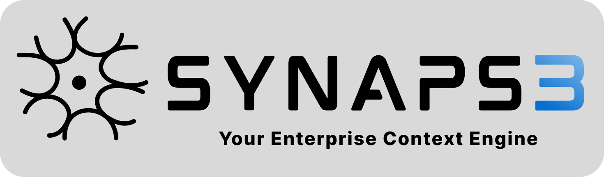

<div align="center">



### Agentic MCP server generator

Turn any codebase into a production-ready [Model Context Protocol](https://modelcontextprotocol.io) server — from your terminal, in seconds.

[Homepage](https://synaps3.ai) · [Docs](https://synaps3.ai/docs) · [Report an issue](https://github.com/2ndbrainlabs-ai/synapse-cli/issues) · [Discussions](https://github.com/2ndbrainlabs-ai/synapse-cli/discussions)

[](https://www.npmjs.com/package/@2ndbrainlabs-ai/synapse-cli)
[](https://nodejs.org)
[](./LICENSE)
[](https://www.npmjs.com/package/@2ndbrainlabs-ai/synapse-cli)
[](https://github.com/2ndbrainlabs-ai/synapse-cli/actions/workflows/ci.yml)

</div>

---

## What is Synapse?

Synapse is a CLI that reads your codebase and generates a runnable MCP server — the tool schemas, argument marshalling, and boilerplate are all handled for you. Point it at a project, describe what you want exposed, and drop the resulting server into Claude Desktop, Cursor, or any MCP-compatible client.

The CLI does source exploration **client-side** — nothing is uploaded. Generation runs on the Synapse backend so model routing, retries, and quota stay centrally managed.

## Install

```bash
npm install -g @2ndbrainlabs-ai/synapse-cli
```

Requires **Node.js 18+**. Verify with `synapse --version`.

## Quick start

```bash
cd my-project
synapse init                    # one-time: paste your API key
synapse analyze                 # scans code, writes .synapse/schema.json
synapse build                   # discovers use cases, prompts you to pick
```

The generated server lands at `./mcp_server.py`. Copy the printed JSON snippet into your MCP client config and you're done.

Prefer to describe it yourself:

```bash
synapse build --query "Expose user auth and profile lookup as MCP tools"
```

## Run locally with your own Anthropic key

Skip the hosted Synapse service entirely — codegen runs in-process using **your** Anthropic key. No quota, no code upload, no signup required.

```bash
export ANTHROPIC_API_KEY=sk-ant-…

cd my-project
synapse init --local            # writes mode: "local" to .synapse/config.json
synapse build                   # uses your Anthropic key, generates locally
```

Prefer a one-shot without changing the project's mode:

```bash
synapse build --local --anthropic-key sk-ant-…
```

The Anthropic key is **never stored on disk** — it's read from `ANTHROPIC_API_KEY` or the `--anthropic-key` flag on every invocation. Locally-generated servers don't count against any quota; analyze runs are unbounded.

Anonymous usage telemetry (no code, no prompts — just event names + counts) still flows to `api.synaps3.ai` so we can see adoption. Opt out with `SYNAPSE_TELEMETRY=0`.

**Local-mode limits:**
- Python target only (TypeScript target follows).
- Auto flow (`--auto`) requires the hosted service. Use `--custom` (the default in local mode).

## Features

- **Zero boilerplate** — tool schemas, argument validation, and MCP wire format handled for you.
- **Client-side exploration** — grep, AST symbol lookup, and definition/usage tracing all run on your machine.
- **First-class Python + TypeScript** — full symbol and navigation support. Go, Java, C#, Rust get grep-based fallback.
- **Streaming gRPC** — bidirectional session with the agent so you can watch tool calls land in real time.
- **Deterministic surface extraction** — tree-sitter parsers with a 64KB head-sniff make repeat runs cache-friendly.
- **Signed API keys** — Ed25519 envelope keys, per-request quota, revocation in under 30 seconds.

## Commands

| Command | Purpose |
|---|---|
| `synapse init [--force]` | Initialize Synapse in the current project. Prompts for API key. |
| `synapse analyze [-o <dir>] [-v]` | Scan the codebase and build a symbol/schema map. |
| `synapse build [-q <query>] [-o <file>] [--no-validate] [--no-docs] [-g]` | Generate an MCP server. Without `-q`, discovers candidate use cases. |
| `synapse config [--update] [--key <k>] [--global]` | View or update config. |
| `synapse info` | Show project state and account quota. |
| `synapse update` | Update the CLI to the latest npm release. |
| `synapse uninstall` | Remove global config and uninstall. |

Add `--dev` to any command to talk to a local backend on `localhost:50051`.

## Configuration

Config is resolved in this order:

1. Environment variables (`SYNAPSE_API_KEY`, `SYNAPSE_BACKEND_URL`, `SYNAPSE_DEV=1`)
2. Project-local `./.synapse/config.json`
3. Global `~/.synapse/config.json`

## How `build` works

`synapse build` opens a bidirectional gRPC stream with the backend agent. The agent never sees your code — it *asks the CLI* for exactly what it needs:

- `read_file`, `find_files`, `grep` — bounded reads over your working directory
- `list_symbols`, `find_definition`, `find_usages` — AST navigation via tree-sitter
- `write_file`, `replace_file`, `insert_file` — final artifact writes

Every tool call is scoped to `process.cwd()`. Only the specific bytes the agent asks for flow back over the wire.

## Language support

| Language | Symbol extraction | Discovery | Generation |
|---|---|---|---|
| Python | ✅ | ✅ | ✅ |
| TypeScript / JavaScript / TSX / JSX | ✅ | ✅ | ✅ |
| Go, Java, C#, Rust | grep + patterns | partial | best-effort |

## Troubleshooting

| Message | Fix |
|---|---|
| `Not Initialized` on `build` | Run `synapse init` |
| `Analysis Required` | Run `synapse analyze` |
| `Quota Exceeded` | Check `synapse info` |
| Backend error mid-build | The CLI retries transient errors. Quote the `Session:` id when opening an issue. |

## Documentation

- **Getting started** — [synaps3.ai/docs](https://synaps3.ai/docs)
- **API reference** — [synaps3.ai/docs/api](https://synaps3.ai/docs/api)
- **Examples** — [github.com/2ndbrainlabs-ai/synapse-examples](https://github.com/2ndbrainlabs-ai/synapse-examples)

## Development

```bash
git clone https://github.com/2ndbrainlabs-ai/synapse-cli.git
cd synapse-cli
npm install
npm run dev -- <command>        # run against source
npm run build                   # produce dist/
npm test                        # vitest suite
npm run typecheck
```

## Contributing

Contributions are welcome. See [CONTRIBUTING.md](./CONTRIBUTING.md) for how to file issues, run the test suite, and open a PR. All participation is subject to our [Code of Conduct](./CODE_OF_CONDUCT.md).

## Security

Please review our [Security Policy](./SECURITY.md) before reporting vulnerabilities.

## License

Licensed under the [Apache License, Version 2.0](./LICENSE). See [NOTICE](./NOTICE) for attribution.

---

## Star History

<a href="https://star-history.com/#2ndbrainlabs-ai/synapse-cli&Date">
  
</a>

---

<div align="center">

Built by [2nd Brain Inc.](https://2ndbrainlabs.ai)

</div>
